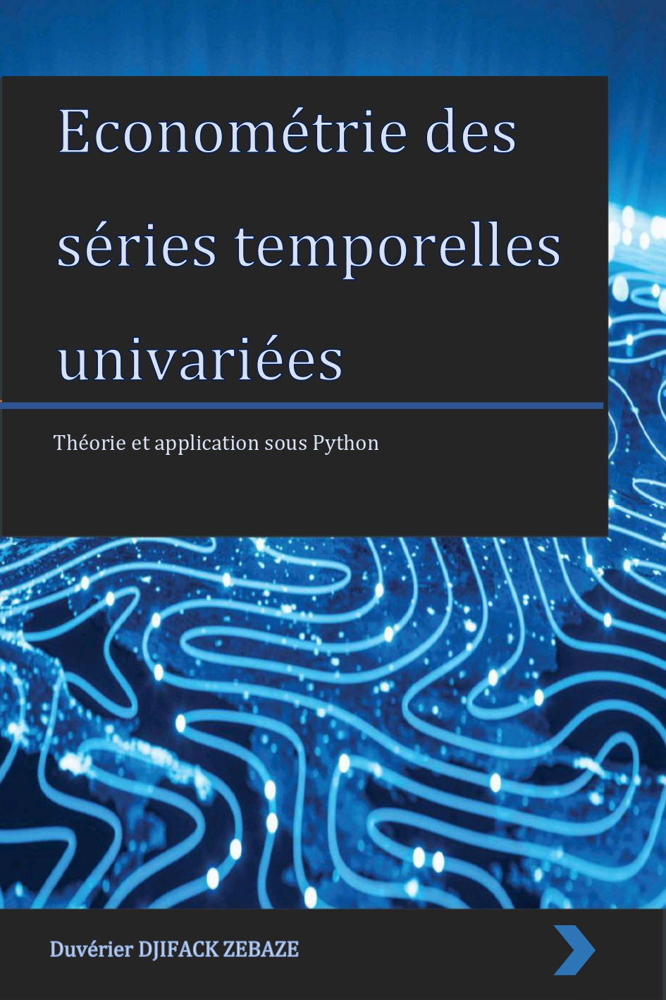

<h2 id="descriptif">Descriptif</h2>
<ul>
<li><a href="4e_couverture_series_temps_univaries.pdf">4e de couverture</a></li>
<li><a href="univariate_times_series_sommaire.pdf">Sommaire détaillé</a></li>
</ul>

<h2 id="auteurs">Auteur</h2>
<a href="https://github.com/enfantbenidedieu">Duvérier DJIFACK ZEBAZE</a>

<h2 id="boutique">Lien de téléchargement</h2>

[<a href="https://github.com/enfantbenidedieu/univariate-times-series">Par ici!</a>]

<h2 id="matériel-disponible">Matériel disponible</h2>

<ul>
<li><a href="https://regression-avec-r.github.io/donnees.html">Jeux de données</a></li>
<li><a href="https://regression-avec-r.github.io/code.html">Lignes de code utilisées dans les chapitres </a></li>
<li><a href="https://regression-avec-r.github.io/correction_exo.html">Proposition de correction des exercices</a></li>
</ul>

